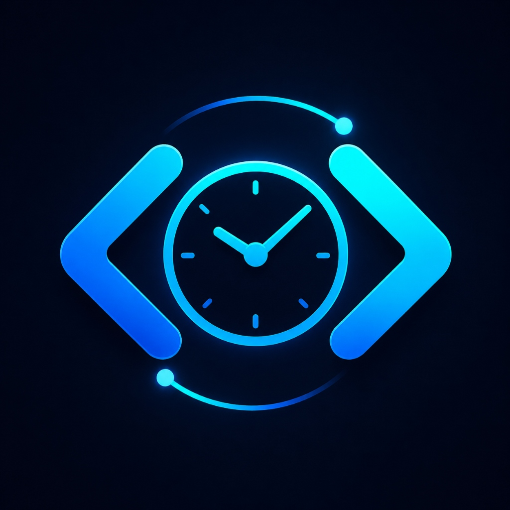
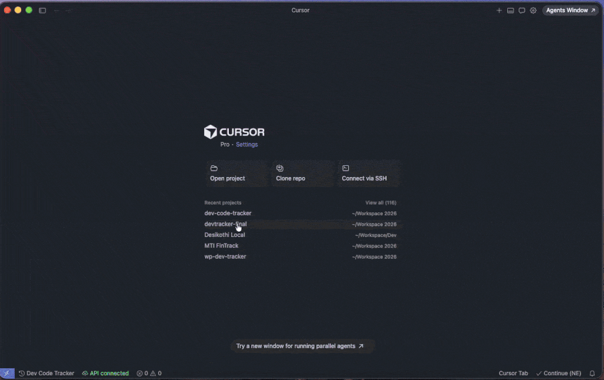

<p align="center">
  
</p>

<h1 align="center">Dev Code Tracker</h1>

<p align="center">
  <strong>Know exactly how long you code. Zero setup. Zero cloud. Zero accounts.</strong>
</p>

<p align="center">
  <a href="https://marketplace.visualstudio.com/items?itemName=KuldipsinhParmar.dev-code-tracker"></a>
  &nbsp;
  <a href="https://marketplace.visualstudio.com/items?itemName=KuldipsinhParmar.dev-code-tracker"></a>
  &nbsp;
  <a href="https://marketplace.visualstudio.com/items?itemName=KuldipsinhParmar.dev-code-tracker"></a>
</p>

---

<p align="center">
  
</p>

---

## Why Dev Code Tracker?

Most time trackers require an account, send your data to the cloud, or charge a monthly fee. Dev Code Tracker keeps everything local — your data never leaves your machine unless you choose to sync it.

| Feature | Dev Code Tracker | Cloud-Based Trackers |
|---|---|---|
| Account required | **No** | Yes |
| Data stays on your machine | **Always** | No |
| Works fully offline | **Yes** | Partial |
| Cost | **Free** | Paid plans |
| Self-hosted sync option | **Yes** | No |

---

## How It Works

```
Open project  →  timer starts  →  ⏱ Dev Code Tracker - 0s
Working...    →  ⏱ Dev Code Tracker - 1h 23m 45s  (counts every second)
Idle 5 min    →  session saved  →  ⏱ Dev Code Tracker - 1h 23m  (static total)
Come back     →  new session starts  →  ⏱ Dev Code Tracker - 0s
Close VS Code →  session saved automatically
```

- **Session starts** when you open a project folder — no clicks needed
- **Session ends** after 5 minutes of idle (configurable)
- **Multi-Root Workspaces** supported — tracks the folder of the currently active file
- Works with **VS Code**, **Cursor**, **Windsurf**, **Claude Code**, and **VSCodium**
- Click the status bar timer to open your dashboard instantly

---

## Status Bar

| State | Display |
|---|---|
| Active (coding) | `⏱ Dev Code Tracker - 1h 23m 45s` — live counter |
| Idle / between sessions | `⏱ Dev Code Tracker - 2h 15m` — static today total |
| Online sync active | `☁ API connected` |
| Local only | `⊟ Local only` |

---

## Dashboard

Open the **offline local dashboard** directly inside VS Code — no browser needed.

- Bar charts by day and project
- Per-session breakdown with start/end times
- Today's total at a glance
- Fully interactive, works with no internet

---

## Commands

Open the Command Palette (`Ctrl+Shift+P` / `Cmd+Shift+P`) and type **Dev Code Tracker**:

| Command | Shortcut |
|---|---|
| Open Dashboard (Online / Local) | `Cmd+Alt+D` / `Ctrl+Alt+D` |
| Open Local Dashboard (Offline View) | `Cmd+Alt+L` / `Ctrl+Alt+L` |
| Show Today's Summary | — |
| Set Display Name for Project | — |
| Configure Online API | — |
| Sync to Server Now | — |
| Clear Project Data | — |

---

## Local Data

Sessions are saved locally — no account, no cloud:

```
your-project/
  .devCodeTracker/
    sessions.json
```

Add `.devCodeTracker/` to your `.gitignore` to keep session data private.

Each session stores: `project`, `start_time`, `end_time`, `duration_seconds`, `date`

---

## Online Sync (Optional)

If you want to view history across machines or share with a team, you can self-host a PHP + MySQL backend:

1. Upload `server/` directory contents (`api.php`, `dashboard.html`) to your server
2. Run `server/setup.sql` to create the tables
3. Edit `api.php` — set DB credentials, API key, and `timezone_offset` (e.g. `330` for IST, `-300` for EST)
4. In VS Code: `Ctrl+Shift+P` → **Dev Code Tracker: Configure Online API**
5. Enter your `api.php` URL and secret key

Sessions sync automatically every 5 minutes.

---

## Settings

| Setting | Default | Description |
|---|---|---|
| `devCodeTracker.idleTimeoutMinutes` | `5` | Pause timer after N minutes of inactivity |
| `devCodeTracker.syncIntervalMinutes` | `5` | Auto-sync interval (online mode) |
| `devCodeTracker.apiUrl` | — | Your PHP API endpoint |
| `devCodeTracker.apiKey` | — | Your API secret key |

---

## Enjoying Dev Code Tracker?

A rating on the Marketplace takes 30 seconds and helps other developers find this extension.

[Leave a review on the VS Code Marketplace](https://marketplace.visualstudio.com/items?itemName=KuldipsinhParmar.dev-code-tracker&ssr=false#review-details)

Found a bug or have an idea? [Open an issue on GitHub](https://github.com/KuldipsinhParmar/dev-code-tracker/issues) — all feedback is welcome.

---

**Official Website:** [devcodetracker.workshow.me](https://devcodetracker.workshow.me/)
&nbsp;|&nbsp;
**Built by Kuldipsinh Parmar**
